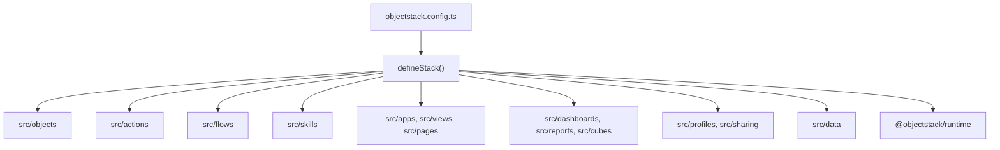

# HotCRM Architecture

> Current architecture for the single-app HotCRM repository.

## Overview

HotCRM is an ObjectStack marketplace app. It is not currently organized as multiple scoped npm packages; the app is assembled from the local `src/` tree and registered through [`objectstack.config.ts`](../objectstack.config.ts).



The compiled marketplace artifact is produced by `pnpm build`. The generated artifact is the package that gets published, not the TypeScript source layout itself.

## Stack Manifest

The stack manifest defines:

| Field | Current value |
| --- | --- |
| id | `app.objectstack.hotcrm` |
| namespace | `crm` |
| version | `2.2.2` |
| type | `app` |
| name | `HotCRM` |

Runtime capabilities are declared in `requires`: `automation`, `triggers`, `analytics`, `auth`, `ui`, `approvals`, and `sharing`. The `ai` capability is deliberately **not** listed: under ObjectStack 16 it is a fail-fast requirement resolved to the closed-edition `@objectstack/service-ai` package, so declaring it would abort open-edition boots. The AI skill metadata still validates and builds into the artifact; see the comment block in [`objectstack.config.ts`](../objectstack.config.ts).

## Metadata Areas

| Area | Files | Registered as |
| --- | --- | --- |
| Data model | `src/objects/*.object.ts` | `objects` |
| Lifecycle hooks | `src/objects/*.hook.ts` via `src/hooks/index.ts` | `hooks` |
| UI actions | `src/actions/*.actions.ts` | `actions` |
| Automation | `src/flows/*.flow.ts` | `flows` |
| AI skills | `src/skills/*.skill.ts` | `skills` |
| Apps, views, pages | `src/apps/`, `src/views/`, `src/pages/` | `apps`, `views`, `pages` |
| Analytics | `src/datasets/`, `src/cubes/`, `src/dashboards/`, `src/reports/` | `datasets`, `analyticsCubes`, `dashboards`, `reports` |
| Security | `src/profiles/`, `src/sharing/` | `permissions`, `sharingRules`, `positions` |
| i18n | `src/translations/` | `translations`, `i18n` |
| Demo data | `src/data/` | `data` |

## Data Model

Objects are declared with `ObjectSchema.create()` and use the explicit `crm_` namespace prefix.

```typescript
import { ObjectSchema, Field } from '@objectstack/spec/data';

export const Account = ObjectSchema.create({
  name: 'crm_account',
  label: 'Account',
  fields: {
    name: Field.text({ label: 'Account Name', required: true }),
    owner: Field.lookup('user', { label: 'Account Owner' }),
  },
});
```

Current objects:

| Domain | Objects |
| --- | --- |
| Sales | `crm_lead`, `crm_account`, `crm_contact`, `crm_opportunity`, `crm_opportunity_line_item`, `crm_forecast`, `crm_competitor` |
| Service | `crm_case`, `crm_knowledge_article`, `crm_task` |
| Marketing | `crm_campaign`, `crm_campaign_member` |
| Revenue | `crm_product`, `crm_quote`, `crm_quote_line_item`, `crm_contract` |

## Hooks

Object lifecycle hooks live beside object definitions in `src/objects/*.hook.ts`. They are collected in `src/hooks/index.ts` and passed to `defineStack({ hooks: allHooks })`.

Use hooks for record-level invariants and cross-object maintenance that must run with data changes, such as:

- lead defaults and conversion bookkeeping
- opportunity probability and approval fields
- quote and line-item total calculations
- case SLA and escalation fields
- account and contact relationship maintenance

## Actions

Actions live in `src/actions/*.actions.ts`. They define record-header, list-item, list-toolbar, modal, and flow-triggering behaviors. Some action bodies are executable metadata and can use constrained capabilities such as `api.write`.

Example shape:

```typescript
export const ConvertLeadAction = {
  name: 'convert_lead',
  label: 'Convert Lead',
  objectName: 'crm_lead',
  type: 'flow',
  target: 'lead_conversion',
  locations: ['record_header', 'list_item'],
};
```

## Flows

Flows live in `src/flows/*.flow.ts` and are registered through `allFlows`. HotCRM uses record-change, scheduled, and screen-style automation for lead conversion, routing, alerts, SLA monitoring, contract renewal, quote expiration, campaign enrollment, and approval paths.

Record-change flows rely on the `triggers` capability declared in the stack manifest.

## UI

HotCRM ships metadata for:

- one primary app surface
- list, kanban, and object-specific views
- record detail pages and utility pages
- dashboards and reports

The UI is metadata-driven. Object field definitions, views, pages, actions, permissions, translations, and sharing rules all influence the rendered experience.

## AI

AI is modeled as ObjectStack metadata. The AI surface is **skills-only** — the two former copilot agents were retired in favor of skills backed by real, registered actions:

| Layer | Files | Examples |
| --- | --- | --- |
| Skills | `src/skills/*.skill.ts` | `live_data`, `lead_qualification`, `email_drafting`, `revenue_forecasting`, `customer_360`, `case_triage` |
| Actions and flows | `src/actions/`, `src/flows/` | lead conversion, case triage, alerts |

Skill instructions require live schema inspection before answering record questions, because admins can change metadata over time.

## Security

Security is assembled from:

- permission profiles in `src/profiles/`
- sharing rules in `src/sharing/`
- flat positions in `src/sharing/positions.ts`

The stack registers `CrmPositions` as the ObjectStack `positions` field (ADR-0090 D3 — positions are flat capability-distribution groups; the v1 role hierarchy's parent links are gone) and registers sharing rules for accounts, opportunities, cases, and territory-style visibility.

## Verification

Use these commands after architecture-affecting changes:

```bash
pnpm validate
pnpm typecheck
pnpm test
```

See [STATUS.md](STATUS.md) for the current validation snapshot.
